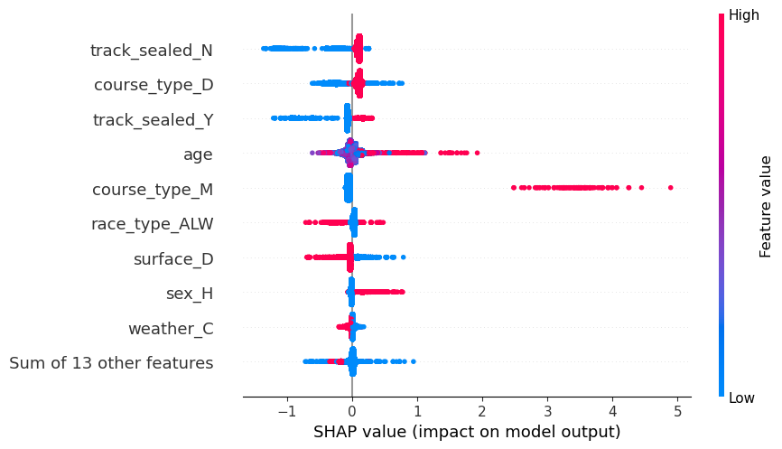
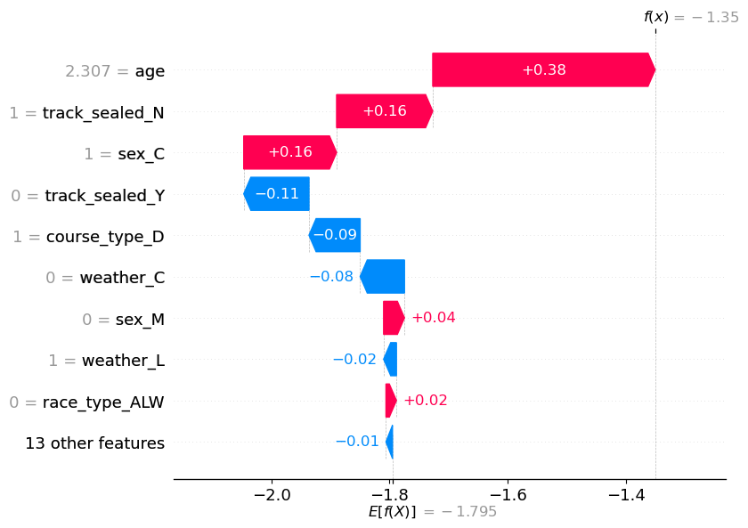
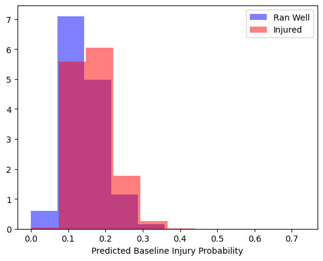

# Baseline Model

The baseline model attempts to quantify a generic rate of injuries and DNFs, based only on very generic features, almost entirely outside of a trainer's control. These include things like:
- Weather
- Horse sex
- Horse age
- Track Conditions
- etc...

This model serves as a way to quantify a trainer's injury record relative to the expected (average) performance. Over many races, the average trainer's DNF rate will converge on the expected rate (xDNF rate). However, if a trainer consistently (large sample size) over or underperforms their xDNF rate, this may be an indication that this trainer is doing something significant to cause this deviation. 

---

## Model Building
The model was trained on data from 2018, 2019, 2021, 2022, and 2023. Note that 2020 was excluded due to COVID. Predictions can still be made about data in any time frame. A future interesting project could be to explore the over/underperformance of DNF vs xDNF in various time periods, such as COVID, different weather conditions, or other variables. 

A simple logistic regression was used, but an extreme gradient boosted (XGBoost) model performed significantly better, so that is used in production.

## Analysis
The model indicated a few interesting learnings:
- Age plays an important role, with younger horses getting injured more often. This may come about because of survivorship bias or that older horses have had more training, built up more muscle or durability. There is also very much an aging "curve", where the risk starts high but falls off exponentially fast and stabilizes in later years.
- Sealed tracks cause a significant increase in injury likelihood, both relative to unsealed tracks and tracks where the weather does not require sealing.
- Maiden races had the highest likelihood of injuries occuring. 

## Plots
The below plot shows the feature importance for the top few features in the model. The red points indicate a higher value, and values to the right of 0 indicate more likely to be injured. For all the features except age, the values are binary (0 or 1). Age is measured in fractional years (for example 3.45) since foal date.

Here is an example of how the model comes to its prediction on one entry. The age of the horse is a significant driver, adding about 38% to the base injury rate. It is a colt (sex_C = 1), which also slighly increases the prediction for this specific instance, whereas the weather slightly moves the prediction the other direction.

This shows the predictions for all races in the training data, with an average value of .146 and a standard deviation of 0.05. 

